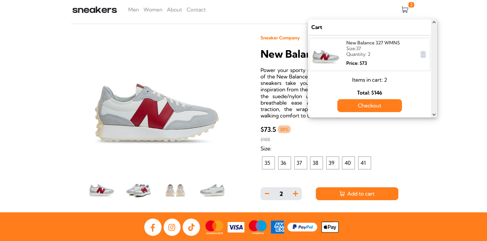

# Sneakers Shop E-commerce website

This is a simple e-commerce website built using JavaScript, NodeJS, Express, and Handlebars.

### Overview

The website uses a json file for storing all product information.
The pages are created dynamically on the server using the handelbars templating engine and in the browser using javascript.

Users are able to:

- View the optimal layout for the site depending on their device's screen size
- See hover states for all interactive elements on the page
- Open a lightbox gallery by clicking on the large product image
- Switch the large product image by clicking on the small thumbnail images
- Add items to the cart
- View the cart and remove items from it
- Send a message using the contact form
- Place an order on the checkout page
- Search for products

### Built with

- HTML5
- CSS3
- JavaScript
- NodeJS
- Express
- Handlebars
- Lightbox
